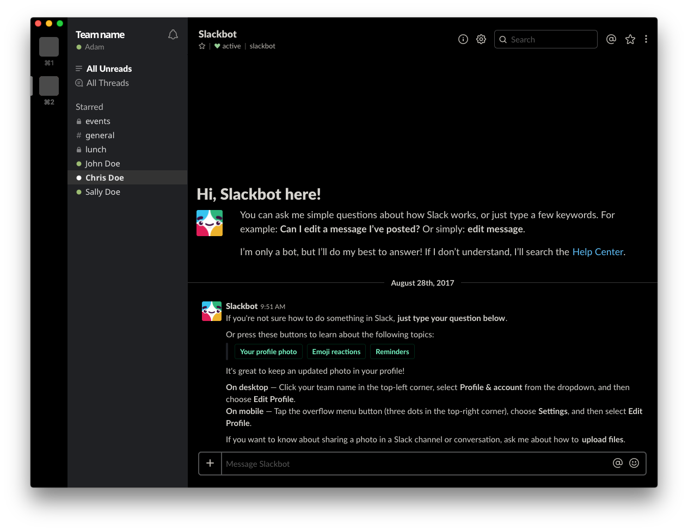

# Slack dark theme injector tool
This tool writes a dark theme to the Slack desktop application. This is a modification of [LostConnection's dark slack theme](https://github.com/LostConnection/makeitdark).

### Preview:



### Prerequisites

Install [python](https://www.python.org/)

You _really_ should take the css file from this site, and host it somewhere _you_ control. It's
not a great idea to have a script inject an arbitrary CSS file from a domain outside of your control,
into an application like Slack that could have sensitive data.

Don't trust me - fork the repo.

### Running

Unix
```bash
sudo python makeitdark.py
```
```bash
sudo python3 makeitdark.py
```

Windows
```bash
python makeitdark.py
```
### Sidebar

Add this sidebar theme:
```
#000000,#444444,#333333,#FFFFFF,#444444,#FFFFFF,#9cbc73,#cc807c
```
Or this one for a pure black sidebar:
```
#000000,#444444,#333333,#FFFFFF,#444444,#FFFFFF,#9cbc73,#cc807c
```

### Reverting

If you want to uninstall the dark Slack theme you can run with the `makeitlight` option:
```
makeitdark.py makeitlight
```

### Slack Updates

When Slack updates it will overwrite the installed dark theme. When this happens just re-run the tool to make it dark again.

### Testing

To make quicker on-the-fly and inspect elements in the main Slack app,

In your terminal, type:
```
export SLACK_DEVELOPER_MENU=true
open /Applications/Slack.app
```
Inside the Slack app, right click anything and select "Inspect element". Paste the following in the console to load up new styles. Change the URI to your own if you're making updates.
```
var cssURI = 'https://raw.githubusercontent.com/adamnel/makeitdark/master/dark-theme.css';
$.get(cssURI).then(function(css) {
   $('<style />').text(css).appendTo('body')
});
```

## Authors

* **Adam Nelson** - *Theme customization* - [adamnel](https://github.com/adamnel)

Original [contributors](https://github.com/LostConnection/makeitdark/contributors) who participated in this project.

## License

This project is licensed under the MIT License - see the [LICENSE](LICENSE) file for details

## Acknowledgments

* Authors of js injection code used
* [Original dark css used](https://github.com/laCour/slack-night-mode)
